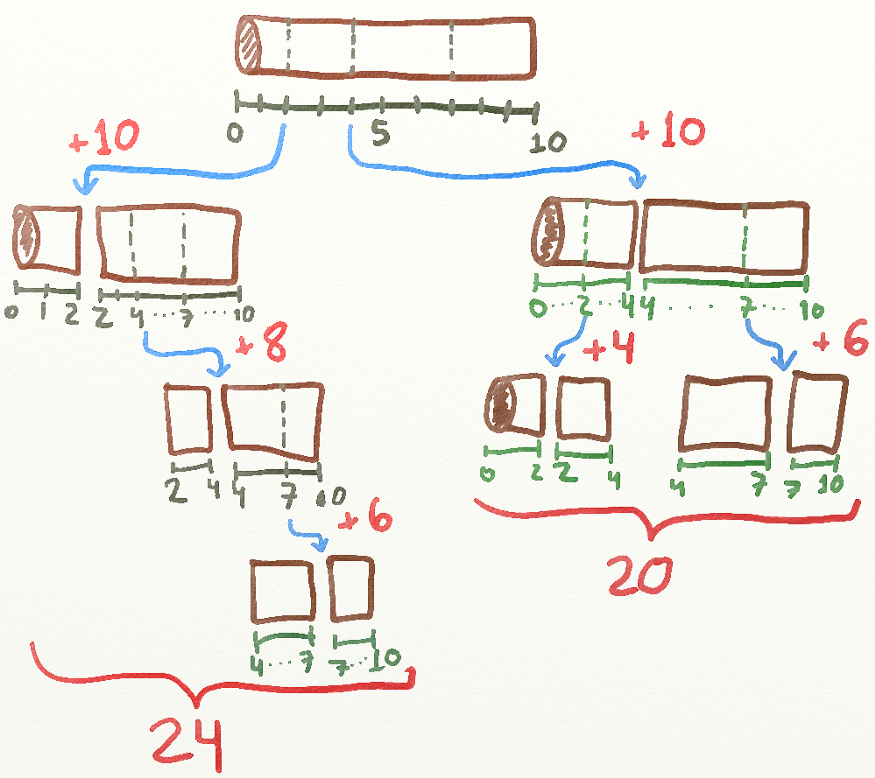

# Team Project

- [Team Project](#team-project)
  - [Problem statement](#problem-statement)
  - [Requirement](#requirement)
  - [Pictorial images for explanation](#pictorial-images-for-explanation)

## Problem statement

- You have to cut a wood stick into pieces. The most affordable company, charges money according to the length of the stick being cut. Their procedure of work requires that they only make one cut at a time. It is easy to notice that different selections in the order of cutting can led to different prices.
- For example:consider a stick of length 10 meters that has to be cut at 2, 4 and 7 meters from one end.There are several choices. One can be cutting first at 2, then at 4, then at 7. This leads to a price of 10 + 8 + 6 = 24 because the first stick was of 10 meters, the resulting of 8 and the last one of 6. Another choice could be cutting at 4, then at 2, then at 7. This would lead to a price of 10 + 4 + 6 = 20, which is a better price. Your boss trusts your computer abilities to find out the minimum cost for cutting a given stick.

## Requirement

- [x] Code
- [ ] Word doc
  - [x] Algorthm
- [x] Junit test cases
- [x] Time complexities
- [x] Pictorial images for explanation

## Algorithm

Input: array, stick start length, end length, array start index, arryend index

1. if start index is less than last index return 0 else go to next step (Wood cannot be futrther separated)
2. Calculate `currCost` based on current length( Diff between end and start length)
3. Initialize `minCost` with any large number
4. Recursively call algorigth to calculate min price for starting and ending part of wood for each element of array (Cutting point)
`int currentMinCost = getMinCost(arr, startLength, arr[i], startIdx, i - 1)`
5. Compare `currentMinCost` and Assign minimun price to `minCost`
6. Calculate total cost as `currCost` (Step 3) + newly added `minCost`(Step 5)

## Time complexity

- O(3 pow (n-1))
  - Each function call its itself tice insie a form loop

## Pictorial images for explanation

- 
